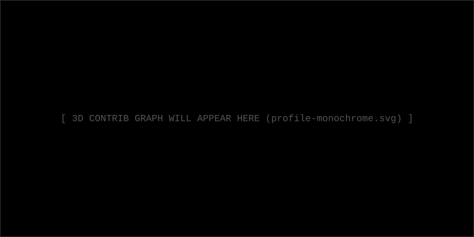

<div align="center">

  

  <br />

  ```bash
  > tail -f /var/log/syslog | grep "anomaly"
  > [WARN] Unidentified entity watching...
  ```

  <br />

  ### ▤ SYSTEM FRAGMENTS ▤

  

  <br />

  ### ▤ ANOMALY LOGS ▤

  <p>
    
  </p>

  <br />
  
  ### ▤ ASSIMILATION PROGRESS ▤

  

  <br /><br />

  ### ▤ SIGNAL INTERCEPT ▤
  
  <p>
    <a href="#"></a>
    <a href="#"></a>
    <a href="#"></a>
    <a href="#"></a>
  </p>

  <br />
  
  

</div>
