<div align="center">

  

  <br />

  ```bash
  > tail -f /var/log/syslog | grep "anomaly"
  > [WARN] Unidentified entity watching...
  ```

  <br />

  

  

  <br />

  

  <p>
    
  </p>
  
  <p>
    
  </p>

  <br />
  
  

  <picture>
    <source media="(prefers-color-scheme: dark)" srcset="https://raw.githubusercontent.com/unicornlite/unicornlite/output/bomberman-contribution-graph-dark.svg" />
    
  </picture>

  <br /><br />

  
  
  <p>
    <a href="#"></a>
    <a href="#"></a>
    <a href="#"></a>
    <a href="#"></a>
  </p>

  <br />
  
  

</div>
